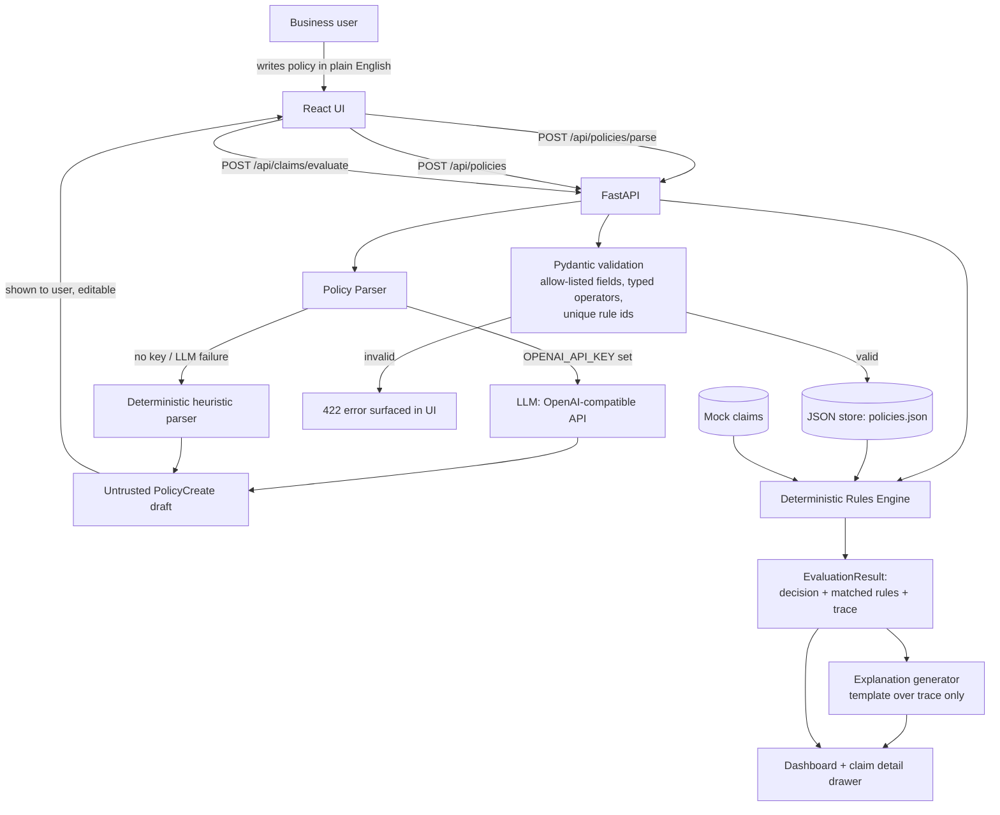

# Policy-Driven Approval Agent

A production-shaped MVP for **Problem 4** of the Supervity Forward Deployed
Engineer technical assessment: convert plain-English expense policies into
structured rules, and evaluate expense claims against those rules with a
fully deterministic, auditable decision engine.

> **Note on source material:** this README and the implementation were built
> from the assessment brief text as provided in the conversation. If the
> original PDF differs from that text in any respect, treat the PDF as
> authoritative and flag the discrepancy — I did not have direct access to
> parse the PDF itself in this environment.

---

## 1. Problem statement

Business users write approval policies in plain English, e.g.:

> "Auto-approve expenses under $500 for Sales. Escalate expenses above
> $2,000. Reject expenses containing prohibited categories."

The system must apply those rules to a batch of expense claims, output
**APPROVE / REJECT / ESCALATE** for each one, and make every decision
**traceable** back to the exact rule(s) that produced it — including
correct handling of boundary values, conflicting rules, and missing data.

## 2. The core engineering principle

**The LLM never makes the final decision.** It only translates natural
language into a structured, schema-validated representation. A separate,
pure, deterministic function evaluates that structure against a claim.
Given the same policy and the same claim, the decision is always the same
— it does not depend on model sampling, prompt drift, or an API being up.

```
Natural-language policy
        │
        ▼
LLM policy parser  (or deterministic heuristic fallback if no API key)
        │
        ▼
Untrusted PolicyCreate draft (JSON)
        │
        ▼
Pydantic schema validation  ── rejects unknown fields, bad operators,
        │                      non-numeric thresholds, empty rule sets…
        ▼
Persisted, trusted Policy object
        │                                    ┌── Claim ──┐
        ▼                                    ▼
Deterministic Rules Engine  (pure function, zero LLM calls)
        │
        ▼
EvaluationResult: decision + matched rules + full per-condition trace
        │
        ▼
Explanation generator (string template over the trace — never invents facts)
        │
        ▼
Dashboard / claim detail drawer
```

The LLM parser and the rules engine are two files that don't import
anything from each other in the "producing a decision" direction —
`rules_engine.py` has no dependency on `policy_parser.py` at all.

## 3. Architecture diagram



## 4. Technology stack

| Layer         | Choice                                                  |
|---------------|----------------------------------------------------------|
| Frontend      | React 19 + Vite, plain CSS design system (no UI kit)     |
| Backend       | Python 3.12 + FastAPI                                    |
| Validation    | Pydantic v2 (strict schemas, custom validators)           |
| AI            | OpenAI-compatible chat completions API (optional)         |
| Persistence   | JSON file (`backend/data/policies.json`)                  |
| Testing       | pytest (engine + parser, no UI/LLM dependency)             |

Deliberately **not** used: Kubernetes, microservices, a real database,
custom auth, or an agent framework — none of it is needed for this problem,
and the brief explicitly calls out avoiding it.

## 5. Setup instructions

### Prerequisites
- Python 3.11+
- Node.js 18+

### Backend

```bash
cd backend
python3 -m venv .venv && source .venv/bin/activate   # optional but recommended
pip install -r requirements.txt
cp .env.example .env        # fill in OPENAI_API_KEY if you want live LLM parsing
uvicorn app.main:app --reload --port 8000
```

The API is now at `http://localhost:8000` (interactive docs at `/docs`).

**No API key required to run the full app.** If `OPENAI_API_KEY` is unset,
or the LLM call fails for any reason, policy parsing automatically falls
back to a deterministic heuristic parser (`app/policy_parser.py::heuristic_parse`)
that handles the phrasings used in this brief. The UI shows which parser
was used on every parse.

### Frontend

```bash
cd frontend
npm install
npm run dev
```

Opens at `http://localhost:5173` and talks to the backend at
`http://localhost:8000` by default (override with `VITE_API_URL`).

### Tests

```bash
cd backend
pytest -v
```

19 tests, all independent of the UI and (mostly) independent of the LLM —
they exercise `evaluate_claim()` and `heuristic_parse()` directly against
hand-built `Policy` / `Claim` objects.

### Production build

```bash
cd frontend && npm run build   # outputs to frontend/dist
cd backend && uvicorn app.main:app --host 0.0.0.0 --port 8000   # no --reload
```

## 6. Environment variables

See `backend/.env.example`. All optional:

| Variable         | Purpose                                             | Default if unset            |
|-------------------|------------------------------------------------------|------------------------------|
| `OPENAI_API_KEY`  | Enables LLM-based policy parsing                     | Falls back to heuristic parser |
| `OPENAI_BASE_URL` | Point at an OpenAI-compatible provider                | OpenAI default endpoint      |
| `OPENAI_MODEL`    | Model name for parsing                                | `gpt-4o-mini`                |
| `DATA_DIR`        | Where `policies.json` is written                       | `backend/data/`              |

No secret is ever hardcoded or shipped to the frontend bundle.

## 7. How policy parsing works

1. `POST /api/policies/parse` receives raw text.
2. If `OPENAI_API_KEY` is set, `llm_parse()` sends a system prompt (see
   `policy_parser.py::SYSTEM_PROMPT`) instructing the model to emit *only*
   a JSON object matching our rule schema — no prose, no markdown fences.
3. The response is parsed as JSON and rebuilt through `Rule(**r)` /
   `PolicyCreate(...)` Pydantic models. Any schema violation (unknown
   field name, wrong operator/value type, empty conditions list) raises a
   validation error.
4. If the API key is missing, the call throws, or the output fails
   validation, the code transparently falls back to `heuristic_parse()` —
   a small deterministic regex/keyword parser that covers "under $X",
   "above $X", "at least/at most $X", department names, and prohibited
   categories. This guarantees the whole pipeline is demoable and testable
   with **zero external dependency**.
5. Either way, the result is a `PolicyDraft` — still untrusted at this
   point. It's shown to the user in the UI. Only when the user clicks
   **Save & activate** does `POST /api/policies` re-validate it through the
   full `Policy` model (uniqueness of rule IDs, etc.) and persist it.
   *The rules engine only ever reads persisted `Policy` objects — it never
   sees a raw LLM response.*

## 8. Deterministic rules engine

`app/rules_engine.py::evaluate_claim(policy, claim)` is a pure function.
Its resolution strategy, in order:

1. If any of `policy.required_fields` is missing on the claim, **stop
   immediately** and return `ESCALATE` with an explicit
   "field X is missing" reason. No guessing.
2. Evaluate every rule's conditions against the claim, recording a full
   trace (field, operator, expected, actual, matched) for **every** rule,
   not just the ones that matched.
3. If zero rules matched, fall back to `policy.default_action`.
4. If one or more rules matched, the winner is the matched rule with the
   **lowest priority number**. Ties (same priority, different actions) are
   broken toward the more conservative action: `REJECT > ESCALATE > APPROVE`,
   because silently letting money move is worse than an unnecessary review.
5. If more than one rule matched, the conflict is surfaced explicitly in
   both `reason` and `explanation` — it is never hidden.

Boundary semantics are literal: "under $500" compiles to strictly `<`, so
a $500.00 claim does **not** match — this is asserted in
`test_boundary_exactly_500_does_not_match_strict_less_than`.

## 9. API endpoints

| Method | Path                              | Purpose                                    |
|--------|-------------------------------------|---------------------------------------------|
| GET    | `/api/health`                       | Liveness check                              |
| POST   | `/api/policies/parse`               | NL text → structured draft (not persisted)   |
| POST   | `/api/policies`                     | Validate + persist a draft                   |
| GET    | `/api/policies`                     | List all policies                            |
| GET    | `/api/policies/{id}`                | Fetch one policy                             |
| PUT    | `/api/policies/{id}`                | Edit a policy                                |
| DELETE | `/api/policies/{id}`                | Delete a policy                              |
| GET    | `/api/claims`                       | List mock claims                             |
| GET    | `/api/claims/{id}`                  | Fetch one claim                              |
| POST   | `/api/claims/evaluate?policy_id=`   | Evaluate all claims against a policy          |
| POST   | `/api/claims/{id}/evaluate?policy_id=` | Evaluate one claim against a policy       |

## 10. Sample policy

```
Auto-approve expenses under $500 for Sales.
Escalate expenses above $2000.
Reject expenses containing prohibited categories.
```

Try also, to see conflict resolution live:

```
Sales expenses under $1000 are approved.
Travel expenses above $500 must be escalated.
```

Run it against claim `EXP-107` (Sales department, Travel category, $700) —
both rules match; `ESCALATE` wins over `APPROVE` at equal priority under
the conservatism tie-break, and both matched rules are shown in the trace.

## 11. Sample claims

12 synthetic claims in `backend/app/sample_data.py` covering: obvious
approval, obvious rejection, obvious escalation, exact `$500` boundary,
exact `$2,000` boundary, department vs. category conflict, missing
department, missing amount, an ambiguous/unusual category, and a
near-boundary value just under each threshold. No real data is used.

## 12. Design tradeoffs

**JSON file persistence instead of a real database.** The brief explicitly
allows this for the MVP. A single `policies.json` file with a
process-level lock is enough to demo correctly and is trivial to inspect.
The tradeoff is no concurrent-write safety and no query capability beyond
"load everything" — fine at this scale, wrong past a handful of
concurrent editors. Swapping in SQLite would only touch `storage.py`.

**Priority is an explicit integer, not "order in the text."** I considered
inferring precedence purely from clause order, but that silently breaks
the moment someone reorders their policy text without meaning to change
its logic. An explicit priority number, visible in the structured-policy
panel, makes precedence a first-class, inspectable fact rather than an
implicit side effect of writing order — at the cost of asking the parser
(LLM or heuristic) to make a judgment call about relative specificity.

**Same-priority ties resolve toward the more conservative action.**
Rather than leaving same-priority conflicts undefined, REJECT beats
ESCALATE beats APPROVE. This is a business policy choice, not a technical
one, and it's documented and tested rather than left as an accident of
dictionary/list ordering.

## 13. Limitations

- The heuristic fallback parser only recognizes the phrasings demonstrated
  in the assessment brief (under/above/at least/at most, department and
  category keywords, "prohibited"). Free-form policy text outside those
  patterns will produce a single conservative catch-all `ESCALATE` rule
  rather than a wrong guess — safe, but not comprehensive.
- `match: "any"` (OR-across-conditions) is supported by the schema and
  engine but the parsers currently only ever emit `match: "all"` (AND).
- No authentication — appropriate for a local technical demo only.
- Persistence is single-file JSON; not safe under concurrent writers.

## 14. Future improvements

- SQLite persistence with proper migrations for multi-user use.
- A `match: "any"` clause in the heuristic parser for "X or Y" policies.
- Versioned policies with a diff view between edits.
- A confidence/ambiguity score surfaced per parsed rule so business users
  know which rules to double-check before saving.
- Batch CSV upload for claims instead of the fixed mock set.

## 15. Project structure

```
supervity-fde/
├── backend/
│   ├── app/
│   │   ├── main.py            # FastAPI app & routes
│   │   ├── models.py          # Pydantic schema (the trust boundary)
│   │   ├── rules_engine.py    # deterministic decision engine
│   │   ├── policy_parser.py   # LLM parser + heuristic fallback
│   │   ├── sample_data.py     # 12 mock claims
│   │   └── storage.py         # JSON persistence
│   ├── tests/
│   │   ├── test_rules_engine.py
│   │   └── test_policy_parser.py
│   ├── requirements.txt
│   ├── pytest.ini
│   └── .env.example
└── frontend/
    ├── src/
    │   ├── components/
    │   │   ├── Sidebar.jsx
    │   │   ├── Dashboard.jsx
    │   │   ├── PolicyBuilder.jsx
    │   │   ├── ClaimDetail.jsx
    │   │   ├── RuleTraceLedger.jsx   # signature traceability component
    │   │   └── StatusBadge.jsx
    │   ├── api.js
    │   ├── App.jsx
    │   ├── App.css
    │   └── index.css
    └── package.json
```
